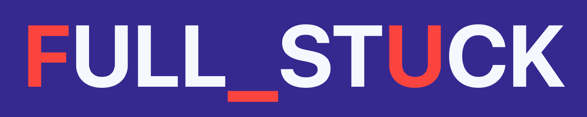
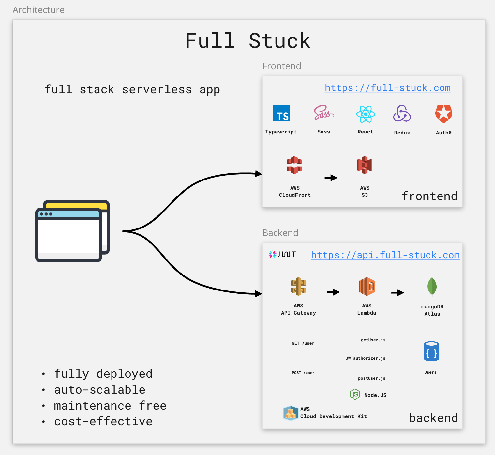
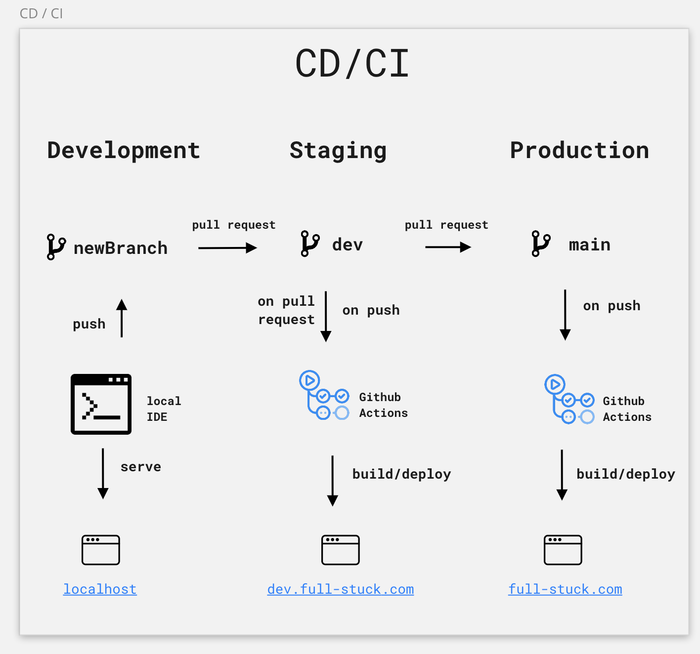

# FULL STUCK

**Full Stack** is a game where you are a software bootcamp student. 

Your goal is to reach to **CEO** by completing all the previous levels.

Complete a level by learning 3 different **technologies** in any order you want.

Check your **schedule** for the next sprint to start playing!

Once you have master your developer skill, you will have to pass the **assessment** to prove your knowledge.

Be careful with bugs!
  
  
# About the project

**Full Stack** was developed in 2 weeks during [CodeWorks software bootcamp](https://codeworks.me/software-engineering-bootcamp/) by the following students:

- Gil Reich
- Ron Chamma
- David Spanjaard
- Pablo Carbonell
- Viktor Ricchiuto

# Architecture 

**Full Stack** is a full stack **serverless** application deployed on https://full-stuck.com 

The frontend is hosted on Amazon S3 and we are using Amazon Cloudfront as CDN to improve performance.

The backend is implemented with Amazon Gateway, Amazon Lambda and Mongo Atlas.

This architecture has the following characteristics:
- auto-scalable 
- maintaince-free
- cost-effective

# Development cycle

We have also implemented a very simple “continuous delivery / continuous integration “ process with Github Actions.  

For example, a pull request to dev or main will automatically deploy the branch we are trying to merge.  

Thanks to this, we improve our testing and reviewing procedures before every merge.

# Run the project

Check for the `readme.md` inside `client` and `backend` folders for the instructions on how to run this project.