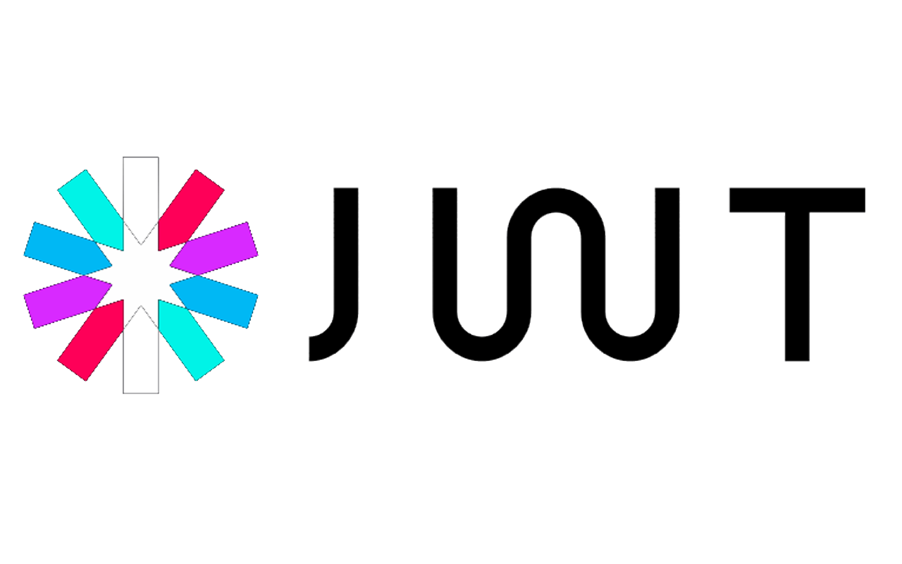

# Backend

  

The backend is a **REST API** implemented on **Amazon Gateway**, **Amazon Lambda** and **Mongo Atlas**.

We authenticate users to the API with **JWT** (JSON Web Tokens).

**Lambda** functions are written in **Node.JS**

## To deploy:

