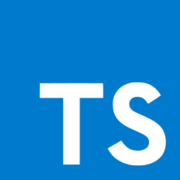

# Frontend

  

The app was built entirely using **Typescript** and **Sass**.

The main libraries we used are:
- **React**
- **Redux** for state management
- **Auth0** for user authentication.

## To run this in project in your local environment:

1. make sure you have the backend running. See instructions on `readme.md` inside the `backend` folder.
2. clone this repo.
3. `npm i` inside this `client` folder.
4. replace the environment variables in the `.env.development.local` file with the values from the step 1.
5. `npm start` and go to https://localhost:3000 (make sure it is **HTTPS** not **HTTP**)
6. profit

## To deploy:
1. make sure you have the backend running. See instructions on `readme.md` inside the `backend` folder.
2. clone this repo.
3. `npm i` inside this `client` folder.
4. replace the environment variables in the `.env.production` file with the values from the step 1.
5. `npm run build`
6. upload the content of the `build` folder into your hosting. Any hosting that serves static files would work perfect (eg. Github pages or AWS S3)
7. profit